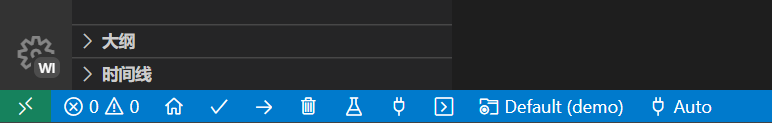

# Electrical Control Workshop

- [Electrical Control Workshop](#electrical-control-workshop)
  - [电路基本知识](#电路基本知识)
    - [1. 欧姆定律](#1-欧姆定律)
    - [2. 电阻电容电感](#2-电阻电容电感)
    - [3. 电源](#3-电源)
    - [4. 半导体](#4-半导体)
    - [5. 信号](#5-信号)
  - [嵌入式基本知识](#嵌入式基本知识)
    - [1. 什么是单片机，什么是SBC，与电脑区别](#1-什么是单片机什么是sbc与电脑区别)
  - [代码基本知识](#代码基本知识)
    - [1. c/cpp](#1-ccpp)
    - [2. micropython](#2-micropython)
  - [开发工具和环境](#开发工具和环境)
    - [1. Arduino IDE](#1-arduino-ide)
    - [2. VSCode + Platform IO](#2-vscode--platform-io)
    - [3. Clion + Platform IO](#3-clion--platform-io)
  - [传感器](#传感器)
    - [1. 传感器 与 传感器模块](#1-传感器-与-传感器模块)
    - [2. 常见传感器种类及使用](#2-常见传感器种类及使用)
  - [电机](#电机)
  - [机器人框架](#机器人框架)
  - [控制算法](#控制算法)
  - [demo](#demo)
  - [扩展](#扩展)

----------

## 电路基本知识

### 1. 欧姆定律

notice *欧姆定律只适用于纯电阻电路，但是仍然可以帮助分析很多电路*

欧姆定律的标准式是 `I=U/R` ，通过这个式子我们能够获得更多更有用的式子，比如 `P=U^2/R = I^2*R`。
在分析电阻的作用时，欧姆定律非常有用。

### 2. 电阻电容电感

notice *各种元件不可避免都具有一定的电阻电容电感，此处所指为电阻器，电容器，电感器*

1. 电阻
不同于初高中物理中的电阻，实际开发中我们不太会单独需要电阻来作为用电器消耗电能。

2. 电容
简单而言，电容是尽量保持电容两端的电压不变的元件
比如当电容与一个灯泡并联时，我们断开电源供电，如果没有电容电灯泡很快就会灭，但是有电容的情况下，电容会放电提供电能给电灯泡，也就是尽量保持电灯泡两端电压不下降。

3. 电感
简单而言，电感是尽量保持通过电感的电流不变的元件。
比如当电感串联在电路中时，如果电流突然下降，则电感会提供额外的电流。

### 3. 电源

### 4. 半导体

1. 二极管
2. 三极管
3. mos管

### 5. 信号

信号主要分为两大类，数字信号与模拟信号。

1. 数字信号
是指自变量是离散的、因变量也是离散的信号，这种信号的自变量用整数表示，因变量用有限数字中的一个数字来表示。在计算机中，数字信号的大小常用有限位的二进制数表示。
绝大多数信号都是数字信号，比如开关的状态是开或关，对应1和0。计算机中数据也都是数字化的。

优点：
缺点：

1. 模拟信号
是指在时域上数学形式为连续函数的讯号。例如声波，是典型的模拟信号。
现实中很多信号的形式是模拟的而非数字的，但是数字计算机不具有直接存储模拟信号的能力，因为数字是有限的而模拟信号理论上来说分辨率是无限的。
比如一段音频文件，我们可以看到它具有一些属性：采样率、位深度等等。这些是模拟信号数字化的体现。
本质上，存储在电脑里的音乐文件是数字化的，尽管声音通常是模拟信号。

优点：
缺点：

----------

## 嵌入式基本知识

### 1. 什么是单片机，什么是SBC，与电脑区别

1. 单片机

2. 单板机（SBC）

3. 比较

----------

## 代码基本知识

### 1. c/cpp

### 2. micropython

----------

## 开发工具和环境

### 1. Arduino IDE

> 优点：烧写代码相当方便，自带串口调试，开发板选型，代码示例，以及arduino第三方库
> 缺点：Arduino IDE代码功能相对简陋，启动慢，开发体验不是很好，默认.ino文件不方便项目管理

1. 安装[Arduino IDE](https://www.arduino.cc/en/software)（建议安装 ide 2）
2. 开箱即用，左上角可以指定开发板类型和串口端口号

> tips:
> 可以在 `File - Preferences` 里面开启自动补全（比较下面位置的 Editor Quick Suggestions）

### 2. VSCode + Platform IO

> 优点：可以使用大家熟悉的工具开发，vscode拥有的各种插件都可以使用，完整的c/cpp开发逻辑
> 缺点：需要配置环境、插件，platform IO相对臃肿，而且需要科学上网，第一次使用可能很难找到各种功能

1. 安装[vscode](https://code.visualstudio.com/)，[python](https://www.python.org/)
2. 安装c/c++，pio插件
3. 打开pio插件主页，新建项目（建立项目的时候需要科学上网）指定开发板类型，项目位置和名称等
4. 打开刚创建的项目，可以在底部看到验证（编译）、烧写、调试等功能

> tips:
>  
> 1. 建议对pio插件采用只在某些工作区启用，不然你的vscode会很卡。
> 2. pio插件与clangd插件冲突，喜欢用clangd代码提示的建议在工作区内禁用clangd且启用c/c++插件（虽然intelli sense代码提示很蠢）
> 3. 然后执行项目任务“Miscelleneous -> Rebuild IntelliSense Index”。（可以直接`ctrl+shift+p`搜索）

### 3. Clion + Platform IO

> 优点：Clion代码开发体验极好
> 缺点：需要配置环境、插件，不习惯ide项目管理的同学可能不适应，库安装不太方便

1. 安装[clion](https://www.jetbrains.com/clion/)，pio插件（因为本人已经先用vscode装好pio了所以不确定clion是否需要另外安装pio）
2. 新建项目时选择嵌入式--PlatformIO，然后指定platformio.exe的路径。（建议添加到环境变量，否则后续步骤可能出问题）
3. 选择配置文件（此处我们使用mega2560，选择对应的配置就行）
4. 右上角可以指定配置，下载就选择下载，调试就选择调试（虽然两者分开很奇怪但是pio就是这样没办法）

----------

## 传感器

### 1. 传感器 与 传感器模块

### 2. 常见传感器种类及使用

----------

## 电机

----------

## 机器人框架

----------

## 控制算法

----------

## demo

----------

## 扩展
